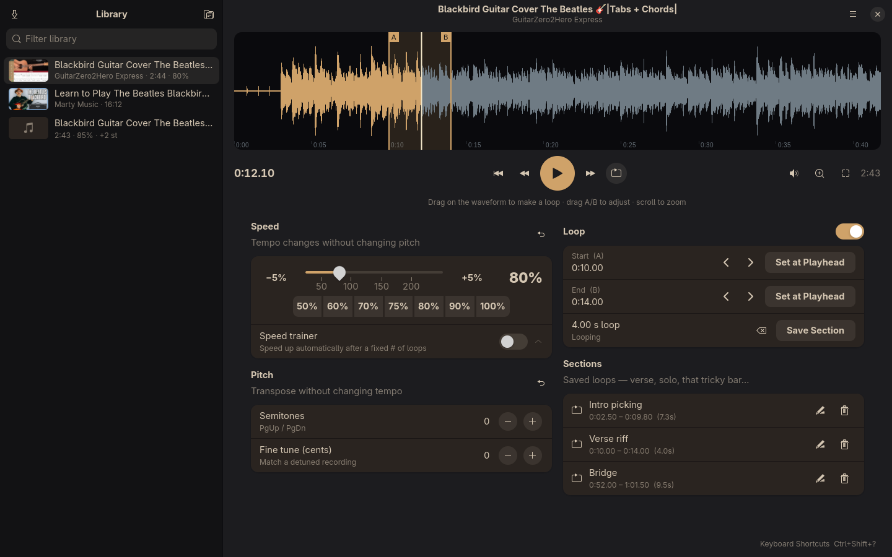

# Riffarchy

A practice player for musicians, built for [Omarchy](https://omarchy.org) and inspired by Riff Studio.
Slow songs down without changing pitch, transpose without changing speed, loop exact phrases,
and pull audio straight off YouTube.



## Install

**From the AUR** (once published): open the Omarchy menu, go to **Install → AUR** and pick `riffarchy`,
or run:

    yay -S riffarchy

**As an Omarchy plugin** (from the [plugin marketplace](https://plugins.omarchy.org) or directly):

    omarchy plugin add https://github.com/jmathew499/riffarchy
    omarchy plugin enable io.github.jmathew499.riffarchy

This installs the whole app and adds a ♪ button to your bar. **Right-click it once** to run setup. Setup
installs any missing packages with pacman and offers to add Riffarchy to the app launcher (Super+Space).
It asks before each step. After that:

- **Left click:** open Riffarchy, or bring its window forward. It's the normal app window, not a popup.
- **Middle click:** play / pause.
- **Right click:** run setup again.
- While a song is loaded the button shows its speed and a ⟳ when the loop is on, and turns your theme's
  highlight colour while playing. To show only the icon, change *Show* in the widget's bar settings.

**To remove the plugin:**

    ~/.config/omarchy/plugins/io.github.jmathew499.riffarchy/omarchy/setup.sh --remove   # launcher entry, if added
    omarchy plugin remove io.github.jmathew499.riffarchy

Your library (`~/.local/share/riffarchy`) and downloads (`~/Music/Riffarchy`) are kept. Delete them too
if you want everything gone.

**Dependencies** (setup installs any that are missing): `python-gobject`, `python-cairo`, `gtk4`,
`libadwaita` ≥ 1.8, `mpv`, `ffmpeg`, `yt-dlp`, `deno`. Optional: `mpv-mpris` for media keys.

**From source**:

    git clone https://github.com/jmathew499/riffarchy.git && cd riffarchy
    ./install.sh          # per-user: runs from the checkout, adds a launcher entry
    # or system-wide:
    sudo make install     # installs to /usr (what the AUR package does)

Requires `python-gobject`, `python-cairo`, `gtk4`, `libadwaita` ≥ 1.8, `mpv`, `ffmpeg`, `yt-dlp` and `deno`
(`install.sh` installs any that are missing). `mpv-mpris` is optional and adds media-key support.

### macOS and Windows (beta, unsigned)
`riffarchy_qt.py` is a Qt version with the same features. GitHub Actions builds it for **macOS (Apple
silicon, macOS 14+)** and **Windows (x64)**, with mpv, FFmpeg, yt-dlp and QuickJS bundled, so there's
nothing else to install. Beta builds come from the
[Actions tab](https://github.com/jmathew499/riffarchy/actions) (and releases once tagged).

#### Installing
Step-by-step guides, including how to open the app the first time while it's unsigned:
- **[macOS install guide](docs/install-macos.md)**: Apple silicon, macOS 14+
- **[Windows install guide](docs/install-windows.md)**: Windows 10/11, 64-bit

#### Running from source
You need Python 3.10+ and `mpv`, `ffmpeg` and `yt-dlp` on your PATH:

    python -m venv .venv
    .venv/bin/pip install -r requirements-qt.txt      # Windows: .venv\Scripts\pip
    .venv/bin/python riffarchy_qt.py

#### Building and testing
    python packaging/fetch_tools.py bin    # pinned, checksummed mpv/ffmpeg/yt-dlp/QuickJS for this OS
    python -m pytest tests                 # add RIFFARCHY_BIN_DIR=bin to test against the bundled tools
    python packaging/build.py              # → dist/*.dmg, *.zip, *-setup.exe
    dist/Riffarchy.app/Contents/MacOS/Riffarchy --selftest report/   # headless end-to-end check

## Features
- **YouTube**: Ctrl+Y opens a search box. Search for something or paste a link, then hit download.
  It uses yt-dlp, saves the audio to `~/Music/Riffarchy`, and shows progress in the library.
- **Speed** 25–250% with pitch preserved (rubberband), plus preset buttons and a **speed trainer**
  that raises the tempo by N% every N loops, up to a target.
- **Pitch**: ±12 semitones, plus ±50 cents fine tuning for detuned recordings.
- **A–B loops**: drag across the waveform, drag the A/B handles, or press `[` / `]`. Nudge in 50 ms steps.
  Scroll to zoom (Shift+scroll pans).
- **Sections**: save named loops per song. Speed, pitch and loop settings are remembered per song.
- **Export** the whole song or just the loop with speed and pitch applied (MP3/WAV/FLAC by extension).
- Follows the active **Omarchy theme** and updates live when you switch themes.
- Drag and drop audio/video files, or open them from the file manager.

## Keys
Space play/pause · ←/→ seek 5 s (Shift: 1 s) · ↑/↓ speed ±5% (Shift: 1%) · PgUp/PgDn ±1 semitone ·
`[` `]` set A/B · L loop · Home back to A · S save section · Z zoom to loop · Shift+Z whole song ·
R reset speed+pitch · Ctrl+Y YouTube · Ctrl+O open · Ctrl+E export · Ctrl+Shift+? all shortcuts

## Files
Library: `~/.local/share/riffarchy/library.json` (waveform and thumbnail caches are stored next to it).
Downloads: `~/Music/Riffarchy`. Built on mpv (JSON IPC) + GTK4/libadwaita, so there are no pip dependencies.

## Code layout
```
riffarchy.py     GTK4/libadwaita front end + Omarchy theming (the only GTK code)
riffarchy_qt.py  Qt (PySide6) front end for macOS/Windows (and Linux); icons drawn in code
omarchy/         Omarchy plugin: bar widget (QML) + consent-based setup.sh; manifest.json is at the root
riffcore/        UI-independent core, shared by every front end (no GTK or Qt imports)
  session.py     Session: playback, A–B loop, Set at Playhead, trainer, volume, sections
                 Downloader: background YouTube downloads into the library
  waveview.py    WaveView: waveform zoom/pan, A/B handle dragging, columns + ruler ticks
  library.py     library.json and per-song settings
  engine.py      mpv over JSON IPC: inherited socketpair on Linux/macOS (mpv quits with the app),
                 named pipe + kill-on-close job on Windows
  media.py       waveform peaks, ffprobe metadata, file scanning, export (rendered by mpv + rubberband)
  theme.py       Omarchy palette reader and waveform colours
  status.py      "now playing" status file the Omarchy bar widget reads (Linux)
  youtube.py     yt-dlp search and download
  paths.py       per-OS data/music dirs; finds bundled or PATH copies of mpv/ffmpeg/yt-dlp
```
A front end creates a `Library`, then a `Session(lib, dispatch, notify=…, message=…, save_needed=…)`.
`dispatch(fn, *args)` must run `fn` on the UI thread (`GLib.idle_add` here, a queued signal in Qt).
After that it reacts to `notify("song" | "peaks" | "playing" | "position" | "speed" | "loop" | …)`.
For packaged macOS/Windows builds, put `mpv`, `ffmpeg`, `ffprobe`, `yt-dlp` and `qjs` (QuickJS-ng,
2.6 MB, used by yt-dlp instead of deno) in a `bin/` folder next to `riffcore/`, or set `RIFFARCHY_BIN_DIR`.
A bundled yt-dlp can update itself from the app menu. `RIFFARCHY_MPV_ARGS=--ao=null` runs mpv without
an audio device (tests, CI).

## Responsible use
Riffarchy downloads audio with yt-dlp so you can practise along with it. Only download material you
have the right to use, and respect YouTube's Terms of Service and the creators whose work you learn from.

## License
MIT. See [LICENSE](LICENSE).
